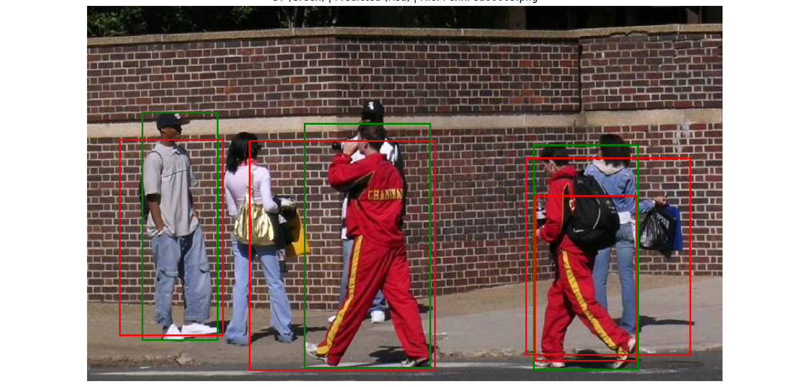
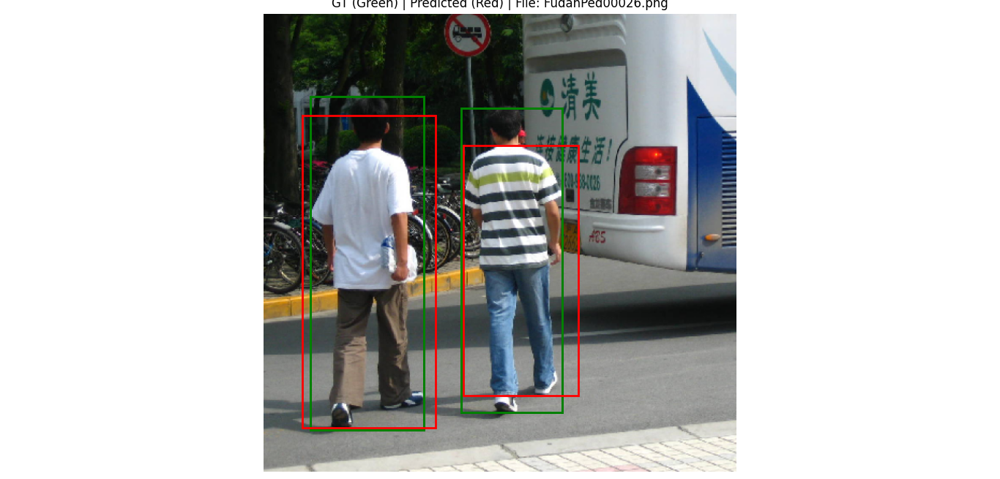

## Fast-RCNN Full Implementation from scratch

This repository contains a clean and complete implementation of **Fast R-CNN** from scratch using **PyTorch**, built and trained on the **Penn-Fudan Pedestrian Dataset**. The goal is to provide a step-by-step, understandable pipeline for learning and experimenting with region-based object detection.

### 1. Dataset Prepration
To prepare the dataset for fast-rcnn run the below command.

    python data_utils.py

  It generate the resize image along with the annotation json file for each image. each annotation file contains ,region proposal boundary box, labels (object or background), target boundary box (used for boundary box regression) and ground truth boundary box

  ### 2. Model Building 
The Fast R-CNN architecture is implemented in model.py using PyTorch.
Core components:

 1.Backbone: Pretrained VGG16 (feature extractor)

 2.RoI Pooling Layer: Fixed-size feature extraction from arbitrary RoIs

3 . Classification Head: Softmax over object/background

4.Regression Head: Bounding box refinements using Smooth L1 Loss

see the whole code in model.py
  ### 3. Training 
  Run the training command to train the model

    python train.py 

### Training pipeline:

    Loads dataset and proposals

    Applies RoI pooling

    Computes multi-task loss: classification + bbox regression

    Saves model checkpoint (fast_rcnn_best.pth)

  ### 4. Inference
   for inference ,

    python inference.py

This script will:

Load a sample image and RoIs

Predict class probabilities and bounding boxes

Visualize predicted (red) and ground truth (green) boxes

### Requirements
Install dependencies using:

    pip install -r requirements.txt

 Project Structure

    fast-rcnn
    ├── data_utils.py           # Dataset preparation and proposal generation
    ├── model.py                # Fast R-CNN model architecture
    ├── train.py                # Training script
    ├── inference.py            # Inference & visualization script
    ├── data/              # Saved region proposals (pickle files)
    ├── annotations/            # JSON annotations (one per image)
    ├── images/                 # Dataset images
    ├── outputs/                # Trained model, visualizations
    └── requirements.txt        # Python dependencies

### Results

check out my blog for theory along with implementation 
https://medium.com/@srikantnayak.2010/fast-r-cnn-explained-architecture-training-and-implementation-f422bca771e0
