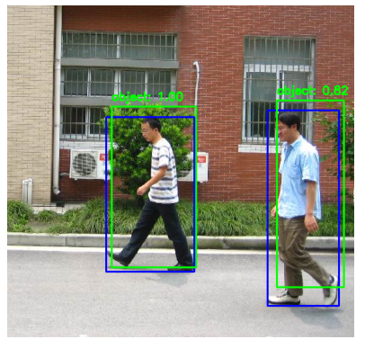

# README.md

## RCNN Object Detection from Scratch on Penn-Fudan Dataset

This project demonstrates an RCNN (Region-based Convolutional Neural Network) object detection implementation **from scratch** using the **Penn-Fudan Pedestrian Detection dataset**. The pipeline includes data preprocessing, region proposal generation,g feature extraction with VGG16, training SVM classifiers and regressors, applying Non-Maximum Suppression (NMS), and inference with visualization.

---

## 📁 Project Structure
```
Object-Detection/
├── data/                        # Contains .npy extracted arrays from Penn-Fudan dataset 
├── src/
│   ├── data_preprocessing.py   # Data loading, region proposal using Selective Search and save .npy 
│   ├── train.py   # VGG16 training and fc2 feature and save the fc2_model.h5 and fc2_feature.npy
│   ├── train_svm.py            # Trains SVM classifier and SVR regressor
│   ├── inference.py            # Inference pipeline with NMS and visualization
│   └── utils.py                # Utility functions (IOU, NMS ,mAp)
├── vgg16_model.h5              # Pretrained VGG16 fine-tuned on our dataset (run model.py)
├── fc2_features.npy            # Extracted fc2 features (run train.py)
├── train_labels.npy              # Object/background labels 
├── train_target_box.npy          # Ground-truth bounding boxes
└── README.md
```

---

## 📚 Dataset: Penn-Fudan Pedestrian
- Download: [Penn-Fudan Database for Pedestrian Detection and Segmentation](https://www.cis.upenn.edu/~jshi/ped_html/)
- Place the unzipped dataset in a directory and preprocess it to generate `.npy` files for images, labels, region proposals, and bounding boxes. ( run data_process.py )

---

## 🔁 Pipeline Steps

### 1. 🧼 Data Preprocessing (`src/data_preprocessing.py`)
- Reads image and annotation files.
- Applies **Selective Search** using OpenCV to generate region proposals.
- Saves `train_image.npy`, `train_label.npy`, `target_box.npy`, etc.

### 2. 🧠 Feature Extraction (`src/model.py`)
- Uses **VGG16 pretrained on ImageNet**.
- Freezes all layers except the final Dense layer.
- Trains with binary cross-entropy for object/background.
- Extracts features from the **fc2 layer** for each image region.
- run train.py to get fc2 layer feature of shape (N, 4096)

### 3. 🏷️ Training SVM & Regressor (`src/train_svm.py`)
- Trains an **SVM classifier** on fc2 features to classify object vs background.
- Trains a **bounding box regressor** (SVR) to predict [x1, y1, x2, y2].

### 4. 📦 Inference + NMS (`src/inference.py`)
- Loads the trained SVM and SVR.
- For a test image, runs region proposals through VGG16 → fc2 features.
- Predicts class and bounding box.
- Applies **Non-Maximum Suppression (NMS)** to select optimal boxes.
- Visualizes predictions vs ground truth. run visualize.py 

### 5. 📦 Run full pipeline  (`src/main.py`)
- call all the necessary function from different python file
- take a one sample image 
- run all the function and call the visualize function


---

## 🧪 Model Evaluation
- **Metric**: Mean Average Precision (mAP)
- **Techniques**:
  - Non-Maximum Suppression (NMS) to reduce duplicate detections
  - Intersection-over-Union (IoU) threshold to validate detections

---

## 📷 Sample Result

![Prediction Result]
- **Blue box**: Ground Truth
- **Green box**: Predicted bounding box (after NMS)

---

## 🚀 How to Run
```bash
# Step 1: Extract data
python src/data_preprocessing.py

# Step 2: Train VGG16 and save fc2 features
python src/model.py
python scr/train.py 

# Step 3: Train SVM and BBox regressor
python src/train_svm.py

# Step 4: Run inference and visualize
python src/inference.py

# Step5: Run main.py
python main.py
```

---

## 💡 Future Improvements
- Use Faster R-CNN architecture
- Integrate real-time inference
- Hyperparameter tuning for SVM and SVR
- GUI for uploading images and showing detection

---

## 📌 Requirements
```bash
python >= 3.8
tensorflow >= 2.11
opencv-python
scikit-learn
matplotlib
numpy
```

---

## ✍️ Author
**Srikant Nayak**  
Email: srikantnayak.2010@gmail.com  
GitHub: [srikant25](https://github.com/srikant25)

